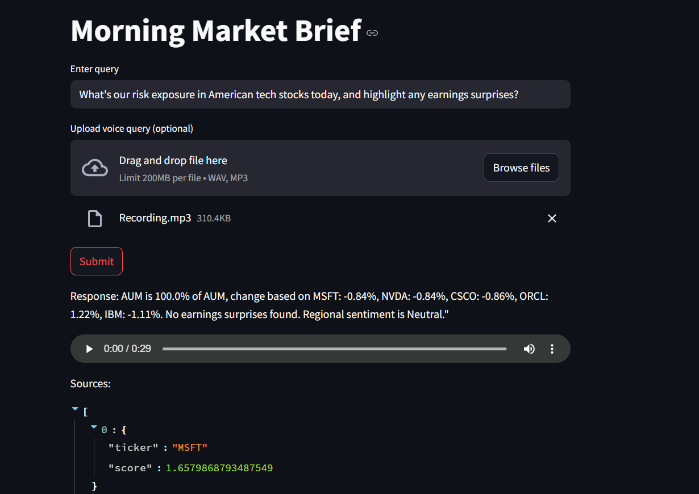

# NewsWhis: Financial Analysis AI Assistant

## 📊 Project Overview

NewsWhis is an AI-powered assistant for financial news summarization, earnings analysis, and speech-based query handling. It leverages:

* **FastAPI** (backend inference and orchestration)
* **Streamlit** (frontend UI)
* **LangChain**, **Transformers**, **Whisper**, **TTS**, **BeautifulSoup**, and **Selenium** for core AI tasks
* Dockerized microservice deployment

---

## 🧰 Architecture Diagram

```
User
  |
  | (Text/Audio Query)
  v
[Streamlit UI] <----> [FastAPI Backend]
                            |
                            |--> [voice_agent.py] (STT via Whisper)
                            |--> [scrap_agent.py] (News/Earnings Scraper)
                            |--> [rag_agent.py] (RAG + FAISS Vector Search)
                            |--> [language_agent.py] (Prompt-based LLM)
                            |--> [api_agent.py] (Market Data Ingestion)
                            |--> [analysis_agent.py] (Financial Insight)
                            |--> [TTS] (Verbal Response)
                            |
                            v
                     [Final JSON + MP3 Response]
```

---

## 🚀 Setup Instructions

### 1. Clone the Repo

```bash
git clone https://github.com/<your-username>/newswhis.git
cd newswhis
```

### 2. Environment Setup

```bash
python -m venv .env
.env\Scripts\activate
pip install -r requirements.txt
```

### 3. Configure `.env`

Create a `.env` file with:

```env
ALPHA_VANTAGE_API_KEY=your_key
SEC_API_KEY=your_key
```

### 4. Run Locally

```bash
# Run FastAPI server
cd orchestrator
python main.py

# In a new terminal, run Streamlit UI
cd streamlit_app
streamlit run app.py
```

---

## 🚫 Dockerized Deployment

### Dockerfile

Located inside `streamlit_app/` or `orchestrator/`, depending on service.

### docker-compose.yml

Top-level file that defines services:

```yaml
services:
  api:
    build: ./orchestrator
    ports:
      - "8000:8000"

  ui:
    build: ./streamlit_app
    ports:
      - "8501:8501"
    depends_on:
      - api
```

### Run Dockerized App

```bash
docker compose up --build
```

---

## 🔄 Framework Comparisons

| Task                | Chosen Tool    | Reason                                 |
| ------------------- | -------------- | -------------------------------------- |
| Backend Inference   | FastAPI        | Async-native, light, robust            |
| UI                  | Streamlit      | Easy TTS/audio output, input form      |
| RAG & LLM           | LangChain + HF | Modular, rapidly evolving, HuggingFace |
| STT                 | OpenAI Whisper | Multilingual, high accuracy            |
| TTS                 | gTTS           | Simple + effective, offline optional   |
| News & SEC Scraping | Selenium + BS4 | Control over structure, target domains |

---

## 📊 Benchmarks (Sample)

| Component         | Latency (Avg) | Notes                            |
| ----------------- | ------------- | -------------------------------- |
| STT (Whisper CPU) | \~10s         | Could drop to \~3s with GPU      |
| SEC News Scrape   | \~6s          | Cached for tickers               |
| FAISS + RAG       | \~1.5s        | Uses sentence-transformers SBERT |
| TTS Response      | \~2s          | gTTS generation time             |

Total E2E Response Time: **\~20 seconds**

## Overview of the app



**Maintainer**: Ron Antony David
**GitHub**: https://github.com/Ronydavison007/News-Whis
